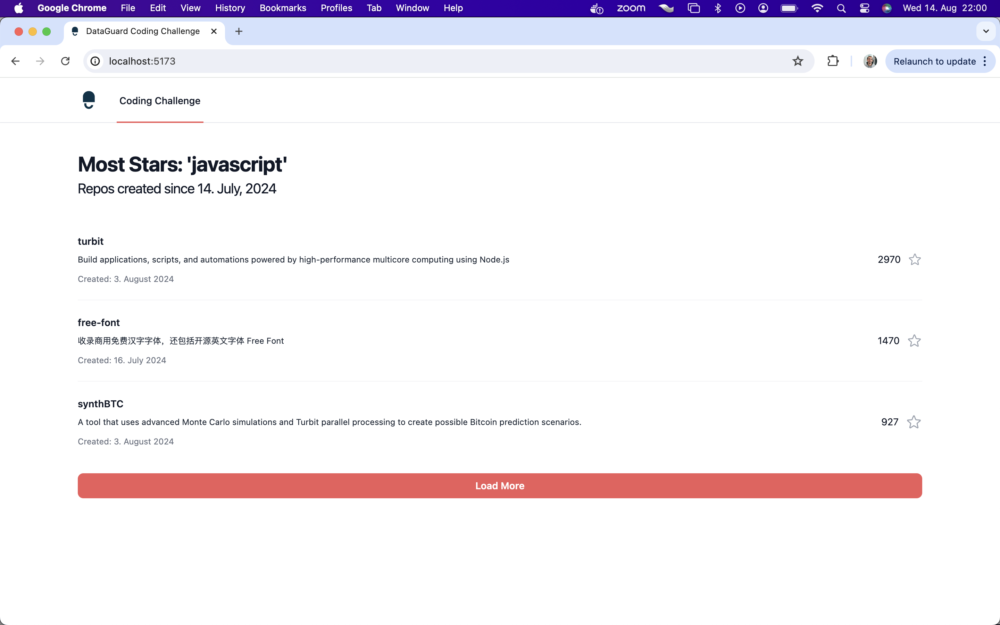
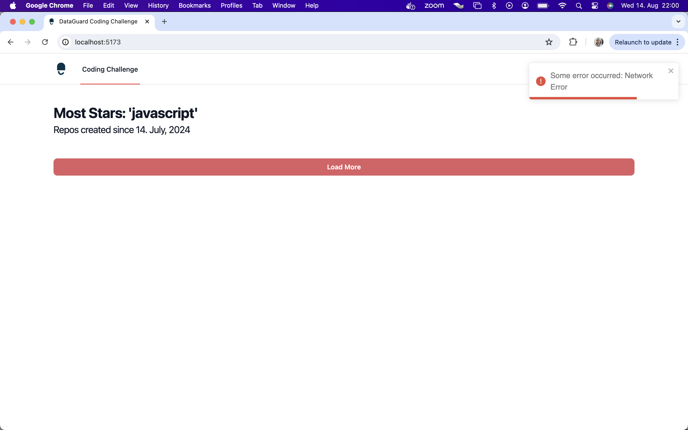

# DataGuard Coding Challenge
*done by Henrik Lippke (15.August, 2024)*

This project contains a webapp, which shows the repositories of the last 30 days, which were written with javascript, sorted by the one with the most stars.

There are always 3 repositories loaded and more can be loaded with the ‘Load More’ button.

This webapp was developed with **Vue3** and **Taildwind**.
In addition, **pinia** was used as a store and **vue3-toastify** to display error messages when loading the repositories from github. In addition, **date-fns** for date formatting and **axios** for Ajax requests have been included.


## Local Development

```sh
docker-compose up --build
```

Open your browser and navigate to [http://localhost:5173/](http://localhost:5173/).

## Screenshots

This screenshot shows the webapp:

This screenshot shows what the error handling looks like:

